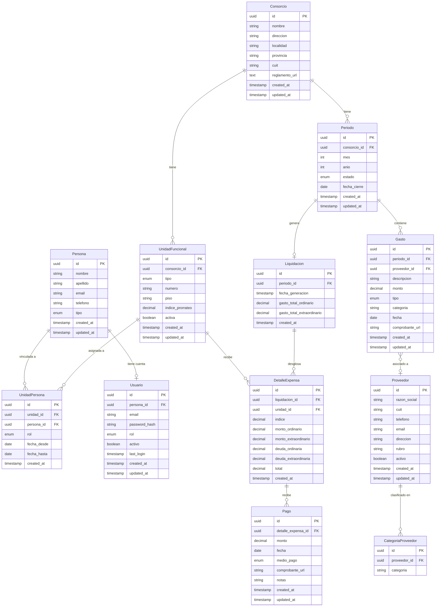

# Modelo de Datos

**Proyecto:** Sistema de Gestion de Consorcio Residencial
**Stack:** FastAPI + PostgreSQL + Docker (backend)
**Ultima actualizacion:** Mayo 2026

---

## Diagrama Entidad-Relacion



---

## Detalle de Entidades

### 1. Consorcio

Representa la persona juridica del consorcio de propietarios. En la primera version el sistema soporta un unico consorcio; la estructura multi-tenant queda preparada para la Fase 6.

| Campo | Tipo | Restricciones | Descripcion |
|-------|------|---------------|-------------|
| `id` | `UUID` | PK, default `gen_random_uuid()` | Identificador unico |
| `nombre` | `VARCHAR(200)` | NOT NULL | Nombre del consorcio |
| `direccion` | `VARCHAR(300)` | NOT NULL | Direccion fisica del edificio |
| `localidad` | `VARCHAR(100)` | NOT NULL | Ciudad o localidad |
| `provincia` | `VARCHAR(100)` | NOT NULL, default `'Buenos Aires'` | Provincia |
| `cuit` | `VARCHAR(13)` | UNIQUE, nullable | CUIT del consorcio (formato XX-XXXXXXXX-X) |
| `reglamento_url` | `TEXT` | nullable | URL al archivo del reglamento de copropiedad |
| `created_at` | `TIMESTAMP` | NOT NULL, default `now()` | Fecha de creacion del registro |
| `updated_at` | `TIMESTAMP` | NOT NULL, default `now()` | Fecha de ultima modificacion |

**Indices:**
- `ix_consorcio_cuit` en `cuit` (unico, parcial: WHERE cuit IS NOT NULL)

---

### 2. UnidadFuncional

Cada unidad independiente del edificio: departamentos y cocheras. El indice de prorrateo determina la participacion proporcional en los gastos comunes.

| Campo | Tipo | Restricciones | Descripcion |
|-------|------|---------------|-------------|
| `id` | `UUID` | PK, default `gen_random_uuid()` | Identificador unico |
| `consorcio_id` | `UUID` | FK -> Consorcio.id, NOT NULL | Consorcio al que pertenece |
| `tipo` | `VARCHAR(20)` | NOT NULL, CHECK (`tipo IN ('departamento', 'cochera')`) | Tipo de unidad |
| `numero` | `VARCHAR(10)` | NOT NULL | Numero o identificador de la unidad (ej: "1", "A", "F") |
| `piso` | `VARCHAR(10)` | nullable | Piso del edificio (null para cocheras) |
| `indice_prorrateo` | `DECIMAL(5,2)` | NOT NULL, CHECK (`indice_prorrateo > 0 AND indice_prorrateo <= 100`) | Porcentaje de participacion en gastos |
| `activa` | `BOOLEAN` | NOT NULL, default `true` | Si la unidad esta activa en el sistema |
| `created_at` | `TIMESTAMP` | NOT NULL, default `now()` | Fecha de creacion |
| `updated_at` | `TIMESTAMP` | NOT NULL, default `now()` | Fecha de ultima modificacion |

**Constraints:**
- `uq_unidad_consorcio_tipo_numero`: UNIQUE (`consorcio_id`, `tipo`, `numero`)
- La suma de `indice_prorrateo` de todas las unidades activas de un consorcio debe ser 100.00 (validado a nivel de aplicacion, no de base de datos)

**Indices:**
- `ix_unidad_consorcio_id` en `consorcio_id`
- `ix_unidad_tipo` en `tipo`

**Datos reales:**

| Unidad | Tipo | Numero | Piso | Indice |
|--------|------|--------|------|--------|
| Depto 1 | departamento | 1 | 1 | 16.68% |
| Depto 2 | departamento | 2 | 2 | 13.13% |
| Depto 3 | departamento | 3 | 3 | 12.91% |
| Depto 4 | departamento | 4 | 4 | 13.13% |
| Depto 5 | departamento | 5 | 5 | 12.91% |
| Depto 6 | departamento | 6 | 6 | 13.13% |
| Depto 7 | departamento | 7 | 7 | 12.91% |
| Cochera A | cochera | A | - | 0.85% |
| Cochera B | cochera | B | - | 0.85% |
| Cochera C | cochera | C | - | 0.85% |
| Cochera D | cochera | D | - | 0.85% |
| Cochera E | cochera | E | - | 0.85% |
| Cochera F | cochera | F | - | 0.95% |

Suma total de indices: 100.00%

---

### 3. Persona

Representa a una persona fisica vinculada al consorcio. Se separa de Usuario para permitir que existan personas registradas que aun no tengan cuenta de acceso al sistema.

| Campo | Tipo | Restricciones | Descripcion |
|-------|------|---------------|-------------|
| `id` | `UUID` | PK, default `gen_random_uuid()` | Identificador unico |
| `nombre` | `VARCHAR(100)` | NOT NULL | Nombre de pila |
| `apellido` | `VARCHAR(100)` | NOT NULL | Apellido |
| `email` | `VARCHAR(255)` | UNIQUE, nullable | Correo electronico |
| `telefono` | `VARCHAR(20)` | nullable | Telefono de contacto |
| `tipo` | `VARCHAR(20)` | NOT NULL, CHECK (`tipo IN ('propietario', 'inquilino')`) | Tipo de persona en el consorcio |
| `created_at` | `TIMESTAMP` | NOT NULL, default `now()` | Fecha de creacion |
| `updated_at` | `TIMESTAMP` | NOT NULL, default `now()` | Fecha de ultima modificacion |

**Indices:**
- `ix_persona_email` en `email` (unico, parcial: WHERE email IS NOT NULL)
- `ix_persona_apellido` en `apellido`

**Datos reales:**

| Nombre | Apellido | Tipo |
|--------|----------|------|
| Pamela | Pitscheider | propietario |
| Elena | Michailenko | propietario |
| Eliana | Iafolla | propietario |
| Claudio | Ghida | propietario |
| Maria | Duarte | propietario |
| Graciela | Farina | propietario |
| Lautaro | Villordo | propietario |

---

### 4. UnidadPersona

Tabla de vinculacion entre unidades funcionales y personas. Modela la relacion M:N con temporalidad: un propietario puede tener multiples unidades, y una unidad puede cambiar de propietario en el tiempo. `fecha_hasta` null indica relacion vigente.

| Campo | Tipo | Restricciones | Descripcion |
|-------|------|---------------|-------------|
| `id` | `UUID` | PK, default `gen_random_uuid()` | Identificador unico |
| `unidad_id` | `UUID` | FK -> UnidadFuncional.id, NOT NULL | Unidad funcional |
| `persona_id` | `UUID` | FK -> Persona.id, NOT NULL | Persona vinculada |
| `rol` | `VARCHAR(20)` | NOT NULL, CHECK (`rol IN ('propietario', 'inquilino')`) | Rol de la persona respecto a la unidad |
| `fecha_desde` | `DATE` | NOT NULL | Inicio de la vinculacion |
| `fecha_hasta` | `DATE` | nullable | Fin de la vinculacion (null = vigente) |
| `created_at` | `TIMESTAMP` | NOT NULL, default `now()` | Fecha de creacion |

**Constraints:**
- CHECK (`fecha_hasta IS NULL OR fecha_hasta >= fecha_desde`)
- Una unidad solo puede tener un propietario activo a la vez (validado a nivel de aplicacion)
- Una unidad solo puede tener un inquilino activo a la vez (validado a nivel de aplicacion)

**Indices:**
- `ix_unidad_persona_unidad_id` en `unidad_id`
- `ix_unidad_persona_persona_id` en `persona_id`
- `ix_unidad_persona_vigente` en (`unidad_id`, `rol`) WHERE `fecha_hasta IS NULL`

**Datos reales (vinculos vigentes):**

| Persona | Unidad | Rol |
|---------|--------|-----|
| Pitscheider Pamela | Depto 1 | propietario |
| Michailenko Elena | Depto 2 | propietario |
| Michailenko Elena | Cochera E | propietario |
| Michailenko Elena | Cochera F | propietario |
| Iafolla Eliana | Depto 3 | propietario |
| Iafolla Eliana | Cochera C | propietario |
| Ghida Claudio | Depto 4 | propietario |
| Duarte Maria | Depto 5 | propietario |
| Duarte Maria | Cochera D | propietario |
| Farina Graciela | Depto 6 | propietario |
| Farina Graciela | Cochera B | propietario |
| Villordo Lautaro | Depto 7 | propietario |
| Villordo Lautaro | Cochera A | propietario |

---

### 5. Usuario

Cuenta de acceso al sistema. Se vincula 1:1 con Persona. Soporta los tres roles definidos en las personas del producto.

| Campo | Tipo | Restricciones | Descripcion |
|-------|------|---------------|-------------|
| `id` | `UUID` | PK, default `gen_random_uuid()` | Identificador unico |
| `persona_id` | `UUID` | FK -> Persona.id, UNIQUE, NOT NULL | Persona asociada a esta cuenta |
| `email` | `VARCHAR(255)` | UNIQUE, NOT NULL | Email de login (puede diferir del email de Persona) |
| `password_hash` | `VARCHAR(255)` | NOT NULL | Hash bcrypt de la contrasena |
| `rol` | `VARCHAR(20)` | NOT NULL, CHECK (`rol IN ('admin', 'propietario', 'inquilino')`) | Rol de acceso al sistema |
| `activo` | `BOOLEAN` | NOT NULL, default `true` | Si la cuenta esta habilitada |
| `last_login` | `TIMESTAMP` | nullable | Ultimo inicio de sesion |
| `created_at` | `TIMESTAMP` | NOT NULL, default `now()` | Fecha de creacion |
| `updated_at` | `TIMESTAMP` | NOT NULL, default `now()` | Fecha de ultima modificacion |

**Indices:**
- `ix_usuario_email` en `email` (unico)
- `ix_usuario_persona_id` en `persona_id` (unico)
- `ix_usuario_rol` en `rol`

**Notas:**
- El administrador es tambien propietario. Su registro de Persona tiene `tipo = 'propietario'` pero su Usuario tiene `rol = 'admin'`. El rol del usuario determina los permisos en el sistema, no el tipo de persona.
- Un usuario `admin` hereda todos los permisos de `propietario` mas las funciones de administracion.

---

### 6. Periodo

Representa un mes de gestion del consorcio. Contiene los gastos y genera una liquidacion. El estado controla si se pueden modificar gastos o registrar nuevos.

| Campo | Tipo | Restricciones | Descripcion |
|-------|------|---------------|-------------|
| `id` | `UUID` | PK, default `gen_random_uuid()` | Identificador unico |
| `consorcio_id` | `UUID` | FK -> Consorcio.id, NOT NULL | Consorcio al que pertenece |
| `mes` | `SMALLINT` | NOT NULL, CHECK (`mes BETWEEN 1 AND 12`) | Mes del periodo |
| `anio` | `SMALLINT` | NOT NULL, CHECK (`anio >= 2020`) | Anio del periodo |
| `estado` | `VARCHAR(20)` | NOT NULL, default `'abierto'`, CHECK (`estado IN ('abierto', 'liquidado', 'cerrado')`) | Estado del periodo |
| `fecha_cierre` | `DATE` | nullable | Fecha en que se cerro el periodo |
| `created_at` | `TIMESTAMP` | NOT NULL, default `now()` | Fecha de creacion |
| `updated_at` | `TIMESTAMP` | NOT NULL, default `now()` | Fecha de ultima modificacion |

**Constraints:**
- `uq_periodo_consorcio_mes_anio`: UNIQUE (`consorcio_id`, `mes`, `anio`)

**Indices:**
- `ix_periodo_consorcio_id` en `consorcio_id`
- `ix_periodo_estado` en `estado`
- `ix_periodo_anio_mes` en (`anio`, `mes`)

**Transiciones de estado:**
```
abierto --> liquidado --> cerrado
                |
                +--> abierto (si se necesita corregir)
```
- `abierto`: se pueden agregar, editar y eliminar gastos.
- `liquidado`: se genero la liquidacion. Los gastos no se pueden modificar. Se pueden registrar pagos. Se puede reabrir a `abierto` si hay correcciones (esto elimina la liquidacion existente).
- `cerrado`: periodo finalizado. No se permiten modificaciones de ningun tipo. Irreversible.

---

### 7. Gasto

Cada egreso del consorcio en un periodo dado. Se clasifica como ordinario o extraordinario, lo que impacta directamente en el calculo de expensas y en quien puede pagarlo (propietario vs inquilino).

| Campo | Tipo | Restricciones | Descripcion |
|-------|------|---------------|-------------|
| `id` | `UUID` | PK, default `gen_random_uuid()` | Identificador unico |
| `periodo_id` | `UUID` | FK -> Periodo.id, NOT NULL | Periodo al que se imputa |
| `proveedor_id` | `UUID` | FK -> Proveedor.id, nullable | Proveedor asociado (null si no aplica) |
| `descripcion` | `VARCHAR(300)` | NOT NULL | Descripcion del gasto |
| `monto` | `DECIMAL(12,2)` | NOT NULL, CHECK (`monto > 0`) | Monto en pesos argentinos |
| `tipo` | `VARCHAR(20)` | NOT NULL, CHECK (`tipo IN ('ordinario', 'extraordinario')`) | Tipo de gasto |
| `categoria` | `VARCHAR(50)` | NOT NULL | Categoria del gasto (ej: limpieza, servicios, mantenimiento) |
| `fecha` | `DATE` | NOT NULL | Fecha del gasto o factura |
| `comprobante_url` | `TEXT` | nullable | URL al comprobante digitalizado |
| `created_at` | `TIMESTAMP` | NOT NULL, default `now()` | Fecha de creacion |
| `updated_at` | `TIMESTAMP` | NOT NULL, default `now()` | Fecha de ultima modificacion |

**Indices:**
- `ix_gasto_periodo_id` en `periodo_id`
- `ix_gasto_tipo` en `tipo`
- `ix_gasto_categoria` en `categoria`
- `ix_gasto_proveedor_id` en `proveedor_id`
- `ix_gasto_fecha` en `fecha`

**Categorias iniciales (configurables):**
- `servicios`: ABSA, electricidad, gas
- `limpieza`: servicio de limpieza de partes comunes
- `mantenimiento`: ascensor, bomba de agua, pintura
- `seguros`: seguro del edificio
- `impuestos`: ABL, tasas municipales
- `honorarios`: honorarios del administrador
- `extraordinario`: reparaciones mayores, mejoras aprobadas por asamblea
- `otros`: gastos que no encajan en categorias anteriores

---

### 8. Liquidacion

Documento mensual que consolida los gastos de un periodo y calcula la expensa de cada unidad. Solo puede existir una liquidacion por periodo.

| Campo | Tipo | Restricciones | Descripcion |
|-------|------|---------------|-------------|
| `id` | `UUID` | PK, default `gen_random_uuid()` | Identificador unico |
| `periodo_id` | `UUID` | FK -> Periodo.id, UNIQUE, NOT NULL | Periodo que liquida |
| `fecha_generacion` | `TIMESTAMP` | NOT NULL, default `now()` | Momento en que se genero la liquidacion |
| `gasto_total_ordinario` | `DECIMAL(12,2)` | NOT NULL, CHECK (`gasto_total_ordinario >= 0`) | Suma de gastos ordinarios del periodo |
| `gasto_total_extraordinario` | `DECIMAL(12,2)` | NOT NULL, default `0`, CHECK (`gasto_total_extraordinario >= 0`) | Suma de gastos extraordinarios del periodo |
| `created_at` | `TIMESTAMP` | NOT NULL, default `now()` | Fecha de creacion |

**Indices:**
- `ix_liquidacion_periodo_id` en `periodo_id` (unico)

**Regla de negocio:**
- `gasto_total_ordinario` = SUM de Gasto.monto WHERE tipo = 'ordinario' para el periodo
- `gasto_total_extraordinario` = SUM de Gasto.monto WHERE tipo = 'extraordinario' para el periodo
- La creacion de una Liquidacion cambia el estado del Periodo de `abierto` a `liquidado`

---

### 9. DetalleExpensa

Linea de detalle de la liquidacion para cada unidad funcional. Contiene el calculo de la expensa y la deuda acumulada. Es el registro central que un propietario consulta para saber cuanto debe.

| Campo | Tipo | Restricciones | Descripcion |
|-------|------|---------------|-------------|
| `id` | `UUID` | PK, default `gen_random_uuid()` | Identificador unico |
| `liquidacion_id` | `UUID` | FK -> Liquidacion.id, NOT NULL | Liquidacion a la que pertenece |
| `unidad_id` | `UUID` | FK -> UnidadFuncional.id, NOT NULL | Unidad funcional |
| `indice` | `DECIMAL(5,2)` | NOT NULL | Indice de prorrateo aplicado (snapshot al momento de liquidar) |
| `monto_ordinario` | `DECIMAL(12,2)` | NOT NULL, CHECK (`monto_ordinario >= 0`) | Expensa ordinaria del periodo |
| `monto_extraordinario` | `DECIMAL(12,2)` | NOT NULL, default `0`, CHECK (`monto_extraordinario >= 0`) | Expensa extraordinaria del periodo |
| `deuda_ordinaria` | `DECIMAL(12,2)` | NOT NULL, default `0`, CHECK (`deuda_ordinaria >= 0`) | Deuda ordinaria acumulada de periodos anteriores |
| `deuda_extraordinaria` | `DECIMAL(12,2)` | NOT NULL, default `0`, CHECK (`deuda_extraordinaria >= 0`) | Deuda extraordinaria acumulada de periodos anteriores |
| `total` | `DECIMAL(12,2)` | NOT NULL, CHECK (`total >= 0`) | Total a pagar por la unidad |
| `created_at` | `TIMESTAMP` | NOT NULL, default `now()` | Fecha de creacion |

**Constraints:**
- `uq_detalle_liquidacion_unidad`: UNIQUE (`liquidacion_id`, `unidad_id`)

**Indices:**
- `ix_detalle_liquidacion_id` en `liquidacion_id`
- `ix_detalle_unidad_id` en `unidad_id`

**Formulas de calculo:**
```
monto_ordinario       = gasto_total_ordinario * (indice / 100)
monto_extraordinario  = gasto_total_extraordinario * (indice / 100)
deuda_ordinaria       = total_periodo_anterior - pagos_ordinarios_recibidos
deuda_extraordinaria  = total_extraordinario_anterior - pagos_extraordinarios_recibidos
total                 = monto_ordinario + monto_extraordinario + deuda_ordinaria + deuda_extraordinaria
```

**Ejemplo con datos reales (abril 2026, gasto ordinario $345,000):**

| Unidad | Indice | Monto ordinario | Deuda ord. | Total |
|--------|--------|-----------------|------------|-------|
| Depto 1 | 16.68% | $57,546.00 | (segun historial) | monto + deuda |
| Depto 2 | 13.13% | $45,298.50 | (segun historial) | monto + deuda |
| Cochera A | 0.85% | $2,932.50 | (segun historial) | monto + deuda |
| Cochera F | 0.95% | $3,277.50 | (segun historial) | monto + deuda |

**Nota sobre el snapshot de indice:** Se almacena el indice vigente al momento de liquidar para mantener la trazabilidad. Si el reglamento de copropiedad modifica los indices, las liquidaciones historicas conservan el valor que se uso en su momento.

---

### 10. Pago

Registro de un pago realizado por un propietario contra un detalle de expensa especifico. Soporta pagos parciales (un propietario puede pagar en cuotas).

| Campo | Tipo | Restricciones | Descripcion |
|-------|------|---------------|-------------|
| `id` | `UUID` | PK, default `gen_random_uuid()` | Identificador unico |
| `detalle_expensa_id` | `UUID` | FK -> DetalleExpensa.id, NOT NULL | Detalle de expensa que se paga |
| `monto` | `DECIMAL(12,2)` | NOT NULL, CHECK (`monto > 0`) | Monto del pago |
| `fecha` | `DATE` | NOT NULL | Fecha en que se realizo el pago |
| `medio_pago` | `VARCHAR(30)` | NOT NULL, CHECK (`medio_pago IN ('transferencia', 'efectivo', 'uala', 'mercadopago', 'otro')`) | Medio de pago utilizado |
| `comprobante_url` | `TEXT` | nullable | URL al comprobante del pago |
| `notas` | `TEXT` | nullable | Observaciones del administrador |
| `created_at` | `TIMESTAMP` | NOT NULL, default `now()` | Fecha de creacion |
| `updated_at` | `TIMESTAMP` | NOT NULL, default `now()` | Fecha de ultima modificacion |

**Indices:**
- `ix_pago_detalle_expensa_id` en `detalle_expensa_id`
- `ix_pago_fecha` en `fecha`
- `ix_pago_medio_pago` en `medio_pago`

**Reglas de negocio:**
- La suma de pagos de un detalle de expensa no puede superar el `total` del detalle (validado a nivel de aplicacion).
- Un pago se puede registrar mientras el periodo este en estado `liquidado` o `cerrado` (los pagos pueden llegar despues del cierre contable).

---

### 11. Proveedor

Persona fisica o juridica que presta servicios al consorcio. Se vincula opcionalmente con los gastos para trazabilidad de egresos.

| Campo | Tipo | Restricciones | Descripcion |
|-------|------|---------------|-------------|
| `id` | `UUID` | PK, default `gen_random_uuid()` | Identificador unico |
| `razon_social` | `VARCHAR(200)` | NOT NULL | Nombre o razon social |
| `cuit` | `VARCHAR(13)` | UNIQUE, nullable | CUIT del proveedor |
| `telefono` | `VARCHAR(20)` | nullable | Telefono de contacto |
| `email` | `VARCHAR(255)` | nullable | Email de contacto |
| `direccion` | `VARCHAR(300)` | nullable | Direccion |
| `rubro` | `VARCHAR(100)` | nullable | Rubro principal (ej: plomeria, electricidad) |
| `activo` | `BOOLEAN` | NOT NULL, default `true` | Si el proveedor esta activo |
| `created_at` | `TIMESTAMP` | NOT NULL, default `now()` | Fecha de creacion |
| `updated_at` | `TIMESTAMP` | NOT NULL, default `now()` | Fecha de ultima modificacion |

**Indices:**
- `ix_proveedor_cuit` en `cuit` (unico, parcial: WHERE cuit IS NOT NULL)
- `ix_proveedor_razon_social` en `razon_social`
- `ix_proveedor_rubro` en `rubro`

---

## Decisiones de Modelado

### D1. UUID como clave primaria

Se usan UUIDs v4 en lugar de IDs autoincrementales por las siguientes razones:
- Permite generar IDs en el cliente sin coordinacion con la base de datos.
- Evita exponer el volumen de registros en las URLs de la API.
- Facilita una futura migracion a multi-tenant (Fase 6) sin colisiones de IDs.

PostgreSQL soporta UUIDs nativamente con el tipo `uuid` y la funcion `gen_random_uuid()`.

### D2. Separacion Persona / Usuario

Se separan las entidades Persona y Usuario porque:
- El administrador necesita registrar propietarios e inquilinos antes de que estos tengan cuenta en el sistema.
- En la Fase 1 (MVP) solo el administrador tiene cuenta de usuario. Los propietarios se agregan como Persona y reciben su cuenta en la Fase 2.
- Permite mantener el directorio de personas del consorcio independiente del sistema de autenticacion.

### D3. Snapshot del indice en DetalleExpensa

El campo `indice` en DetalleExpensa es una copia del indice de prorrateo vigente al momento de liquidar. Esto garantiza que:
- Las liquidaciones historicas son inmutables y auditables.
- Un cambio futuro en los indices (por modificacion del reglamento) no altera liquidaciones ya emitidas.
- Cualquier propietario puede verificar el calculo exacto que se uso.

### D4. Deuda como campo calculado en DetalleExpensa

La deuda (ordinaria y extraordinaria) se almacena como campo en DetalleExpensa en lugar de calcularse on-the-fly porque:
- El calculo depende de los pagos recibidos del periodo anterior, lo que implica una consulta compleja.
- Una vez liquidado el periodo, la deuda es un dato fijo que no debe cambiar.
- Simplifica las consultas de estado de cuenta del propietario.
- La deuda se calcula al momento de generar la liquidacion y queda congelada.

### D5. Periodo con tres estados

Se agrega un estado intermedio `liquidado` entre `abierto` y `cerrado` porque:
- `abierto`: el administrador esta cargando gastos. Puede agregar, editar y eliminar gastos libremente.
- `liquidado`: se genero la liquidacion y se distribuyeron las expensas. Los gastos no se tocan, pero se registran pagos. Si hay un error, se puede reabrir.
- `cerrado`: cierre contable definitivo. Irreversible. Protege la integridad historica.

### D6. Pago vinculado a DetalleExpensa

Cada pago se asocia directamente a un DetalleExpensa (es decir, a una unidad en un periodo especifico) en lugar de a un propietario generico. Esto permite:
- Saber exactamente que periodo y que unidad se pago.
- Calcular la deuda residual de forma precisa.
- Manejar propietarios con multiples unidades sin ambiguedad (ej: Elena con 3 unidades tiene 3 DetalleExpensa por periodo).

### D7. Decimal para montos

Se usa `DECIMAL(12,2)` para todos los campos monetarios:
- 12 digitos totales permiten montos de hasta 9,999,999,999.99 (suficiente para pesos argentinos con inflacion).
- 2 decimales para centavos.
- `DECIMAL` evita los errores de redondeo de `FLOAT` en operaciones financieras.

### D8. Proveedor como entidad separada desde el inicio

Aunque el modulo completo de proveedores es Fase 4, la entidad se incluye desde el MVP porque:
- El campo `proveedor_id` en Gasto es nullable, por lo que no es obligatorio asignar proveedor.
- Permite al administrador empezar a registrar proveedores de forma organica mientras carga gastos.
- Evita una migracion de datos compleja cuando se implemente la Fase 4.

---

## Validaciones a Nivel de Aplicacion

Las siguientes reglas se validan en la capa de servicio (FastAPI) y no como constraints de base de datos, ya que involucran logica de negocio compleja o consultas multi-tabla:

1. **Suma de indices = 100%**: la suma de `indice_prorrateo` de todas las unidades activas de un consorcio debe ser 100.00.
2. **Unicidad de propietario activo**: una unidad funcional solo puede tener un propietario activo (`fecha_hasta IS NULL`) a la vez.
3. **Unicidad de inquilino activo**: una unidad funcional solo puede tener un inquilino activo a la vez.
4. **Tope de pagos**: la suma de pagos de un detalle de expensa no puede superar el campo `total`.
5. **Periodo abierto para gastos**: solo se pueden crear/editar/eliminar gastos en periodos con estado `abierto`.
6. **Periodo liquidado para pagos**: solo se pueden registrar pagos contra detalles de expensa de periodos con estado `liquidado` o `cerrado`.
7. **Cierre irreversible**: un periodo en estado `cerrado` no puede volver a `abierto` ni a `liquidado`.

---

## Migraciones

Las migraciones se gestionan con **Alembic** (integrado con SQLAlchemy). Convenciones:
- Archivo por migracion con timestamp y descripcion: `001_create_consorcio_table.py`
- Cada migracion incluye `upgrade()` y `downgrade()`
- Los seeds de datos iniciales (consorcio, unidades, propietarios) se manejan en migraciones de datos separadas

---

## Consideraciones Futuras

| Tema | Fase | Impacto en el modelo |
|------|------|----------------------|
| Reclamos y mantenimiento | Fase 3 | Nuevas entidades: Reclamo, ComentarioReclamo, con FK a UnidadFuncional y Proveedor |
| Facturas de proveedores | Fase 4 | Nueva entidad: Factura con FK a Proveedor y vinculacion a Gasto |
| Comunicados | Fase 5 | Nuevas entidades: Comunicado, NotificacionUsuario |
| Multi-consorcio | Fase 6 | Ya preparado con `consorcio_id` en las entidades principales. Requiere politicas de aislamiento |
| Intereses por mora | Fase 6 | Campo adicional en DetalleExpensa o tabla separada de intereses |
| Ajustes manuales de deuda | Fase 2 | Nueva entidad: AjusteDeuda para registrar correcciones con motivo y autoria |
