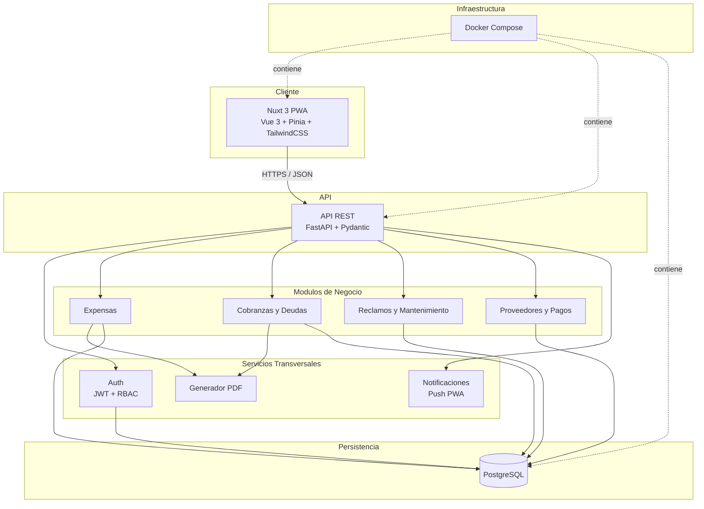
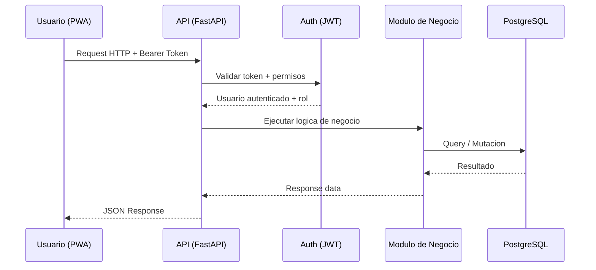
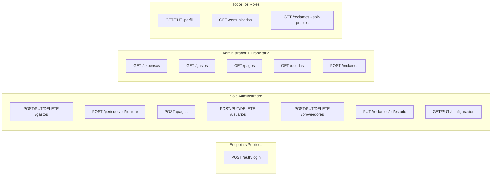
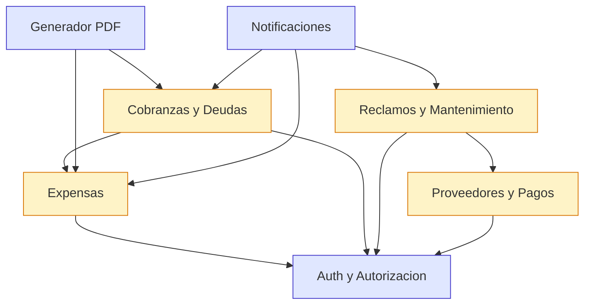

# System Overview

Vision general de la arquitectura del sistema de gestion de consorcio residencial.

---

## 1. Diagrama de Alto Nivel



### Flujo principal de una request



---

## 2. Componentes Principales

### 2.1 Frontend PWA

| Aspecto | Detalle |
|---|---|
| Framework | Nuxt 3 con Vue 3 |
| Estado global | Pinia |
| Estilos | TailwindCSS |
| Lenguaje | TypeScript (strict mode) |
| Renderizado | SSR / SSG segun la ruta |
| PWA | Service Worker para offline basico, instalable en dispositivos moviles |
| HTTP Client | $fetch nativo de Nuxt (basado en ofetch) |
| Validacion | Formularios con validacion client-side antes de enviar al backend |

**Responsabilidades**: renderizado de la interfaz, manejo de estado local y global, comunicacion con la API REST, cache de datos, experiencia offline basica, notificaciones push.

### 2.2 API REST

| Aspecto | Detalle |
|---|---|
| Framework | FastAPI |
| Validacion | Pydantic v2 (schemas de request/response) |
| ORM | SQLAlchemy 2.0 (async) |
| Migraciones | Alembic |
| Autenticacion | JWT (access token + refresh token) |
| Documentacion | OpenAPI auto-generada (/docs, /redoc) |
| Testing | pytest + pytest-asyncio + httpx |

**Responsabilidades**: validacion de entrada, autenticacion y autorizacion, logica de negocio, acceso a datos, generacion de PDFs, exposicion de endpoints RESTful.

### 2.3 Base de Datos

| Aspecto | Detalle |
|---|---|
| Motor | PostgreSQL 16+ |
| Acceso | SQLAlchemy 2.0 async (asyncpg) |
| Migraciones | Alembic con auto-generacion |
| Modelo | Relacional, normalizado, con constraints de integridad |
| Datos iniciales | Seed con datos reales del consorcio (13 unidades, 7 propietarios) |

**Responsabilidades**: persistencia de todos los datos del sistema, integridad referencial, constraints de negocio a nivel de base de datos, indices para queries frecuentes.

### 2.4 Infraestructura

| Aspecto | Detalle |
|---|---|
| Contenedores | Docker + Docker Compose |
| Servicios | 3 contenedores: frontend (Nuxt), backend (FastAPI), base de datos (PostgreSQL) |
| CI/CD | GitHub Actions (lint, tests, build) |
| Repositorio | GitHub (monorepo) |
| Ambientes | Development (local), Staging, Production |

**Responsabilidades**: orquestacion de servicios, reproducibilidad del entorno, pipeline de integracion continua, despliegue automatizado.

---

## 3. Modulos del Sistema

### 3.1 Expensas (Fase 1 - MVP)

Modulo central del sistema. Automatiza la liquidacion mensual de expensas reemplazando el calculo manual en Excel.

**Funciones principales**:
- Gestion de unidades funcionales (13 unidades con indices de prorrateo)
- Registro de gastos ordinarios y extraordinarios por periodo
- Calculo automatico: `expensa_unidad = gasto_total * (indice / 100)`
- Generacion de liquidacion con desglose completo por unidad
- Exportacion a PDF

**Entidades**: UnidadFuncional, Gasto, Periodo, Liquidacion, LineaLiquidacion.

### 3.2 Cobranzas y Deudas (Fase 2)

Registra pagos de propietarios y calcula automaticamente la deuda acumulada entre periodos.

**Funciones principales**:
- Registro de pagos parciales o totales por unidad
- Acumulacion automatica de deuda: `total = deuda_ord_anterior + expensa_ord + deuda_ext_anterior + expensa_ext`
- Estado de cuenta consolidado por propietario
- Historial de pagos con filtros por periodo y unidad

**Entidades**: Pago, Deuda, EstadoCuenta.

### 3.3 Reclamos y Mantenimiento (Fase 3)

Centraliza los reclamos de propietarios e inquilinos con seguimiento de estado.

**Funciones principales**:
- Creacion de reclamos con categoria, descripcion y fotos
- Flujo de estados: Abierto -> En revision -> En trabajo -> Resuelto -> Cerrado
- Asignacion a proveedores
- Hilo de comentarios por reclamo
- Historial con filtros por estado, unidad y categoria

**Entidades**: Reclamo, Comentario, CambioEstado.

### 3.4 Proveedores y Pagos (Fase 4)

Gestiona el directorio de proveedores, facturas y pagos del consorcio.

**Funciones principales**:
- CRUD de proveedores (datos de contacto, CUIT, rubro, datos bancarios)
- Registro de facturas con archivos adjuntos
- Registro de pagos a proveedores con comprobantes
- Categorizacion de gastos
- Reportes de egresos por periodo, categoria y proveedor

**Entidades**: Proveedor, Factura, PagoProveedor, CategoriaGasto.

### 3.5 Autenticacion y Autorizacion

Servicio transversal que protege todos los endpoints del sistema.

**Funciones principales**:
- Login con email y contrasena
- Emision y validacion de JWT (access token + refresh token)
- Control de acceso basado en roles (RBAC): Administrador, Propietario, Inquilino
- Middleware de autorizacion por endpoint
- Gestion de sesiones y logout

**Entidades**: Usuario, Rol, Sesion.

### 3.6 Generacion de PDF

Servicio transversal para generar documentos PDF descargables.

**Funciones principales**:
- Liquidacion mensual de expensas (replica el formato actual del Excel/PDF)
- Estado de cuenta por propietario
- Reportes de gastos por periodo

**Consideraciones**: el PDF debe producir los mismos valores que el Excel actual. Se valida con los datos reales de abril 2026 (gasto total $345,000).

### 3.7 Notificaciones (Fase 5 - Futuro)

Servicio transversal para comunicacion con usuarios via push notifications de la PWA.

**Funciones principales** (planificadas):
- Notificacion de nueva liquidacion disponible
- Notificacion de vencimiento de expensas
- Notificacion de cambios de estado en reclamos
- Comunicados del administrador a todos los propietarios
- Bandeja de entrada unificada

---

## 4. Modelo de Seguridad

### 4.1 Roles del Sistema

| Rol | Descripcion | Cantidad esperada |
|---|---|---|
| Administrador | Propietario con permisos totales de gestion | 1 |
| Propietario | Dueno de una o mas unidades funcionales | 7 |
| Inquilino | Persona que alquila una unidad funcional | Variable (0-7) |

### 4.2 Matriz de Permisos por Endpoint



### 4.3 Detalle de Permisos por Recurso

| Recurso | Administrador | Propietario | Inquilino |
|---|---|---|---|
| Unidades funcionales | CRUD completo | Lectura (solo propias) | Lectura (solo alquilada) |
| Propietarios / Usuarios | CRUD completo | Lectura/edicion propia | Lectura/edicion propia |
| Gastos | CRUD completo | Lectura | Sin acceso |
| Periodos / Liquidacion | Crear, cerrar, ver todos | Ver propios | Ver de su unidad (limitado) |
| Pagos recibidos | Registrar, ver todos | Ver propios | Sin acceso |
| Estado de deuda | Ver todos, ajustar | Ver propio | Sin acceso |
| Reclamos | Gestionar todos | Crear y ver propios | Crear y ver propios |
| Proveedores | CRUD completo | Sin acceso | Sin acceso |
| Comunicados | Crear y enviar | Lectura | Lectura |
| Reportes | Generar y exportar | Sin acceso | Sin acceso |
| Configuracion | Acceso total | Sin acceso | Sin acceso |

### 4.4 Reglas de Seguridad

- **Autenticacion obligatoria**: todo endpoint excepto `/auth/login` requiere JWT valido.
- **Scope por propiedad**: propietarios e inquilinos solo acceden a datos de sus unidades. Nunca ven datos de otros propietarios.
- **Tokens con expiracion**: access token de corta duracion, refresh token rotativo.
- **Validacion server-side**: toda validacion de permisos ocurre en el backend, independientemente de lo que el frontend envie.
- **Rate limiting**: proteccion contra fuerza bruta en el endpoint de login.
- **HTTPS obligatorio**: toda comunicacion entre cliente y servidor es cifrada.
- **Sin datos sensibles en el frontend**: el JWT no contiene informacion financiera; solo identidad y rol.

---

## 5. Principios Arquitectonicos

### Separacion de Concerns

Cada capa tiene una responsabilidad unica y bien definida. El frontend se ocupa de la presentacion, la API de la logica de negocio y validacion, la base de datos de la persistencia e integridad.

```
Frontend (Nuxt 3)     -->  Presentacion, UX, estado local
API (FastAPI)          -->  Validacion, autorizacion, logica de negocio
Base de Datos (PG)     -->  Persistencia, integridad referencial, constraints
```

### API-First

La API REST es el contrato entre frontend y backend. Se define primero la interfaz (endpoints, schemas, respuestas) y luego se implementa. La documentacion OpenAPI auto-generada por FastAPI sirve como fuente de verdad.

### Mobile-First

El diseno de la interfaz parte de pantallas moviles y escala hacia desktop. La PWA debe sentirse nativa en un celular: navegacion con el pulgar, tipografia legible, contraste adecuado. El uso principal va a ser desde el celular del administrador y los propietarios.

### Datos Reales desde el Dia Uno

El sistema se disena y valida con los datos reales del consorcio: 13 unidades funcionales, 7 propietarios, indices de prorrateo reales, montos reales. Los tests de integracion usan estos datos para garantizar que los calculos coinciden con los del Excel actual.

### SDD + TDD

Toda funcionalidad comienza con una especificacion (spec) que define objetivo, criterios de aceptacion y edge cases. El desarrollo sigue el ciclo Red-Green-Refactor. El codigo no se escribe sin spec aprobada ni sin test que falle primero.

### Simplicidad

La arquitectura es deliberadamente simple para un consorcio pequeno. No se agrega complejidad especulativa (microservicios, message queues, event sourcing). Un monolito modular con separacion clara de modulos es suficiente para el alcance actual.

### Transparencia y Auditabilidad

Toda la informacion financiera del consorcio es visible para los propietarios autorizados. Los calculos de expensas son verificables: cualquier vecino puede ver como se llego al monto de su expensa. El sistema registra acciones relevantes con timestamps.

---

## 6. Estructura del Repositorio

```
/
├── frontend/                  # Nuxt 3 PWA
│   ├── pages/                 # Rutas de la aplicacion
│   ├── components/            # Componentes Vue reutilizables
│   ├── composables/           # Logica compartida (hooks)
│   ├── stores/                # Pinia stores
│   ├── layouts/               # Layouts de pagina
│   └── nuxt.config.ts
│
├── backend/                   # FastAPI API REST
│   ├── app/
│   │   ├── api/               # Routers y endpoints
│   │   ├── models/            # Modelos SQLAlchemy
│   │   ├── schemas/           # Schemas Pydantic
│   │   ├── services/          # Logica de negocio
│   │   ├── core/              # Auth, config, dependencias
│   │   └── main.py
│   ├── alembic/               # Migraciones de base de datos
│   ├── tests/                 # Tests pytest
│   └── requirements.txt
│
├── docs/                      # Documentacion del proyecto
│   ├── architecture/          # Documentacion de arquitectura y ADRs
│   ├── product/               # Vision, roadmap, personas, glosario
│   └── sdd/                   # Especificaciones SDD (wip, done, archived)
│
├── docker-compose.yml         # Orquestacion de servicios
└── .github/
    └── workflows/             # CI/CD con GitHub Actions
```

---

## 7. Decisiones de Arquitectura

Las decisiones tecnicas relevantes se documentan como ADRs (Architecture Decision Records) en `docs/architecture/adr/`. Cada ADR registra el contexto, la decision tomada, las alternativas evaluadas y las consecuencias.

| ADR | Titulo | Estado |
|---|---|---|
| 001 | Stack Tecnologico | Aceptado |

---

## 8. Dependencias entre Modulos



**Lectura del grafo**: una flecha de A hacia B significa que A depende de B. Auth es la dependencia transversal de todos los modulos. Expensas es la dependencia central de Cobranzas, PDF y Notificaciones.
